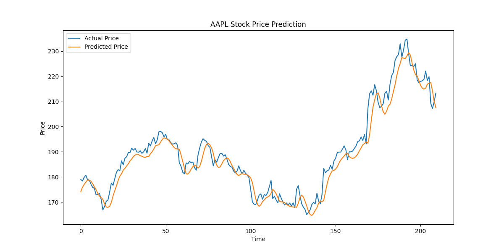

# Stock_prediction_model

Stock Price Prediction using LSTM
This project aims to predict stock prices using an LSTM (Long Short-Term Memory) neural network. It fetches historical stock data from Yahoo Finance, preprocesses it, and trains an LSTM model to forecast future stock prices.
Features

    - Fetches stock data from Yahoo Finance using the yfinance library
    - Stores the data in a MySQL database using the mysql.connector library
    - Preprocesses the data by calculating technical indicators like Moving Average (MA), Relative Strength Index (RSI), and Moving Average Convergence Divergence (MACD)
    - Scales the data using Min-Max Scaler from sklearn.preprocessing
    - Splits the data into training and testing sets
    - Builds an LSTM model using the keras library
    - Trains the model using early stopping and model checkpointing
    - Evaluates the model's performance using RMSE (Root Mean Squared Error) and R-squared metrics from sklearn.metrics
    - Visualizes the actual vs. predicted prices using matplotlib.pyplot

### Results
The LSTM model achieved an **RMSE of 4.27** and an **R-squared value of 0.95** on the test set. This indicates that the model is able to explain 95% of the variance in the predicted stock prices and has an average error of 4.27 units.

### Visualization of Actual vs. Predicted Prices

The model's predictions are visualized against the actual stock prices. The plot below shows how closely the predicted prices follow the actual prices over the training period.

# Disclaimer and Limitations

- __This project is for educational and research purposes only. The stock price prediction model should not be used for any real-world financial decision-making or monetary purposes.__
- __The model's performance is based on historical data and may not accurately predict future stock trends. Past performance is not indicative of future results.__
- __The model is trained on limited data and may not generalize well to all market conditions, sectors, or time periods. Its performance can vary significantly based on the chosen stock symbol and time frame.__
- __Stock prices are influenced by numerous factors, including economic conditions, company performance, investor sentiment, and global events. The model does not account for all these factors and may not capture the full complexity of the stock market.__
- __The model's predictions should be used as a starting point for further research and analysis. Investors should always conduct their own due diligence and consult with financial professionals before making any investment decisions.__
- __The project is not endorsed or affiliated with any stock exchanges, financial institutions, or regulatory bodies. Users should be aware of the risks associated with stock trading and invest at their own discretion.__

### Dependencies
The project requires the following dependencies:

    - pandas
    - yfinance
    - mysql.connector
    - numpy
    - matplotlib
    - scikit-learn
    - keras
    - ta

#### Usage

    - Clone the repository to your local machine.
    - Create a config.py file in your project directory and fill in your MySQL database credentials and Alpha Vantage API key.
    - Install the required dependencies using pip install -r requirements.txt.
    - Run the main.py script to fetch data, train the model, and visualize the results.

